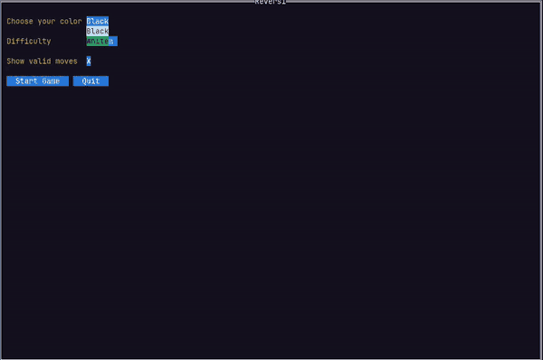

# A simple Reversi game
This is a simple Reversi game implemented in Go. The game is played in the terminal.

## How to play
1. Clone the repository
2. Run the game by executing `go run .` in the terminal
3. Follow the instructions in the terminal to play the game

## Features
- Variable difficulty AI
- Show possible moves

## Preview

